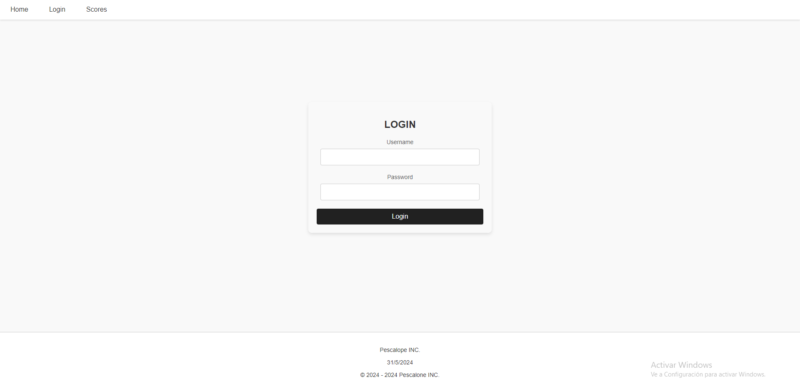
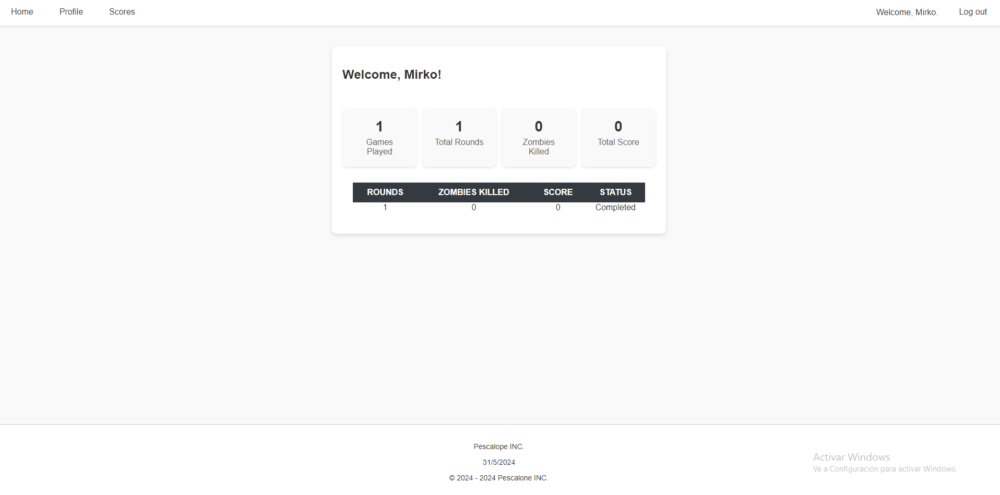

# Final project API

## ¿Qué contiene este repositorio?
- 3 Módulos con los métodos definidos en función de lo que hacen
- Módulo principal que se encarga de mantener el flujo de trabajo de la API
- - DataBase
  - - Este módulo hace de función de CRUD, el cual se encarga de hacer las conexiones a la base de datos mediante prepared statements, de esta manera haciendola segura y evita SQL injections
- - WebSocket
  - - Se encarga de almacenar las consultas hechas mediante el anterior módulo, en formato de JSON, y enviarlas a otro módulo
- - Web
  - - Este último módulo, una vez recibido el JSON del WebSocket, se encargará de mostrar toda la información de manera organizada y mas "user friendly" en diferentes endpoints
   
## ¿Qué tecnologías se han utilizado?
- Base de datos
- - PostgreSQL mediante ElephantSQL
- RunTime
NodeJS
- - Entorno de desarrollo
  - Visual Studio Code
- Maquetación
- - Html y CSS plano

## ¿Cómo se utiliza?
Mediante el módulo de database la API se conecta a la base de datos para hacer sus funciones de CRUD, en función de lo que se pida, hacer SELECT, INSERT, UPDATE, etc. Una vez hecha la consulta la almacena en un fichero JSON el cual el modulo WebSocket se encargará de mandárselo al módulo Web sin que se pierda información por el camino. Finalmente el módulo Web se encargará de mostrar toda la información que ha recibido mediante el JSON y los mostrará en los diferentes endpoints que contiene.

## Endpoints

### Home

### Login

### Scores

### Profile 

